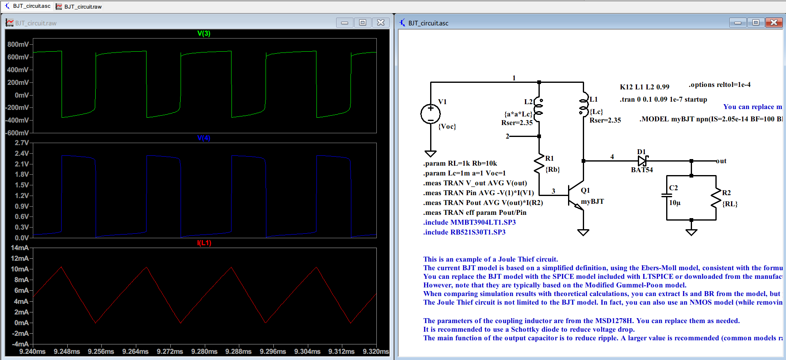

# 🔋 焦耳小偷转换器开源计算代码

[English](README.md)

本仓库提供了我们在IEEE Transactions on Industrial Electronics (TIE)期刊论文中详细介绍的“焦耳小偷”（[Joule Thief](https://en.wikipedia.org/wiki/Joule_thief)）转换器的**开源数学建模、计算代码（MATLAB和Python）**以及**SPICE仿真文件**。它旨在帮助研究人员、工程师和电子爱好者基于我们的解析模型，轻松地计算性能并探索电路参数。如果你对仓库有任何疑问，都欢迎提 issue 问我！

### ❓ Joule Thief 电路是什么？
- **💡 对于非技术人员来说：** 它能让一个较低的 DC 输入电压，转换成一个较高的 DC 输出电压。它的结构非常简单，仅需要一个半导体开关，一个变压器，一个二极管，一个滤波电容和负载。
- **🔬 对于技术专家来说：** 它是一种自振荡的 boost 转换器，工作在边界导通模式。它是属于 blocking oscillator 的一种，最早的起源可能已有接近100年历史，当时还在使用真空管。据我所知，1999年杂志《*Everyday Practical Electronics*》中的这篇文章“*One volt LED--A bright light*”让这一电路为大众所熟知。

### 🌟 Joule Thief 有什么用？
- **🛠️ 对于 DIY 爱好者来说：** 它的成本非常低，并且容易制作，因此在 DIY 社区很受欢迎，也适合作为给学生练习的电路教学项目。一个常见的演示是：把一个已经认为没电的旧电池连接上 Joule Thief，从而点亮需要 1.5V 的 LED。
- **⚡ 对于电源专家来说：** 由于元件数量很少，它非常适合用于超低功耗的电源管理电路，尤其是对于较高内阻的电源。正如论文所展示，当配合零阈值电压的 NMOS，并且面对电源内阻 300 欧姆时，它能在仅仅 **$50\text{mV}$** 的电压下启动。这一强大的冷启动能力，让它在超低电压的能量采集领域具有巨大潜力。

> 📌 **总而言之：** 这是一个非常简单的电路（比你之前想的更有趣），且其能力目前仍被低估。

我们的这一研究成果已经发表在了著名的电力电子期刊 IEEE Transactions on Industrial Electronics。未来还有很多有潜力的应用，欢迎大家继续深入挖掘。我们把它的解析模型与计算代码开源了，希望能方便其他工程师或者学者做进一步的研究。

### 💻 如何使用计算代码
我们提供了基于 BJT 和 NMOS 两种电路的解析计算脚本，分别用 **MATLAB** 和 **Python** 实现。你只需要输入核心的电路参数（例如开路电压 $V_{oc}$，电源内阻 $R_{in}$，初级电感 $L_1$，匝数比 $a$，以及具体的晶体管/二极管静态参数）。代码会自动输出预测的稳态运行指标：
- ⚡ 负载端的**输出电压**（$V_{out}$）
- ⏱️ 开关**振荡频率**（$freq$）
- 🔋 **功率转换效率**（$eff$）

我们还在源代码中附带了针对特定硬件型号（例如 BJT `SMMBT3904LT1G` 和 NMOS `SiUD412ED`）的可运行参数示例代码，帮助你可以立即开始运行测试！

### 📈 关于仿真文件
我提供了 **LTSPICE（免费使用）** 的仿真文件作为参考，你可以通过自定义或者使用制造商的 SPICE 模型来替换其中的元件。进行具体设计时，我建议首先使用理论代码进行快速参数探索，然后结合仿真来观察波形和验证性能。

### 📘 原理解析
如果你对它是如何工作的（包括详细的电路分析、解析模型、理论局限性以及经验法则）感兴趣，请阅读我们专门整理的 **[原理解析文档](Working_Principles_zh.md)** 或是我们的 IEEE TIE 论文。

### 🎓 引用
如果你觉得本文的数学建模或开源代码对你有帮助，请引用我们的论文：

> S. Su and S. Aunet, "Self-Oscillating Joule Thief Converters for MEMS Electromagnetic Energy Harvesting: Analytical Modeling and Experimental Validation," in *IEEE Transactions on Industrial Electronics*, doi: 10.1109/TIE.2026.3663767.
> 
> 🔗 [https://ieeexplore.ieee.org/document/11434838](https://ieeexplore.ieee.org/document/11434838)
