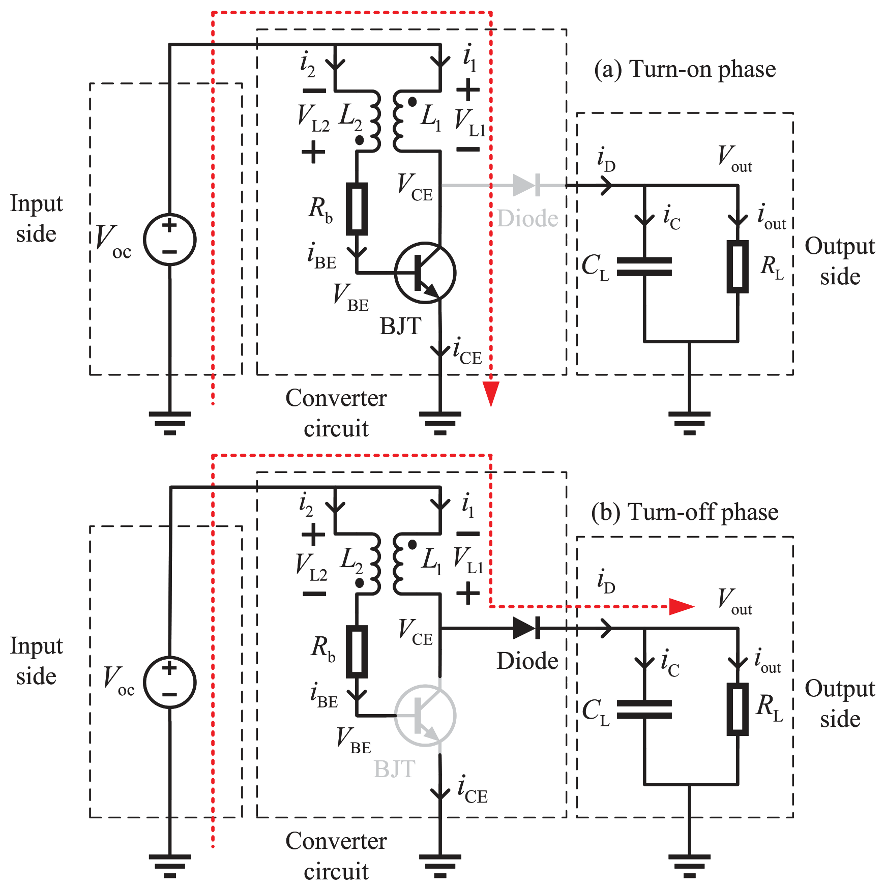

# 焦耳小偷转换器的工作原理

[English](Working_Principles.md)

### 它工作原理是什么？

如上面的电路图所示，Joule Thief主要在两个主要阶段之间交替切换：“导通”阶段和“关断”阶段。该电路依赖于变压器初级线圈（$L_1$）和次级线圈（$L_2$）之间的互感来形成正反馈回路。

#### (a) 导通阶段
当电源（$V_{\text{oc}}$）连接时，最初有一小股电流通过$L_2$流入控制端（BJT的基极或NMOS的栅极），使晶体管开关轻微导通。这使得电流（$i_1$）开始从电源流经初级线圈（$L_1$），进入开关的集电极/漏极。

随着$i_1$的增加，由于变压器的同名端极性，$L_1$中形成的不断变化的磁场会在次级线圈$L_2$中感应出正向电压（$V_{L2}$）。该感应电压与输入电压叠加，显著提高了控制端的电压（对于BJT则注入基极电流）。这就形成了一个**正反馈回路**：更多的初级电流 $\rightarrow$ 更高的次级感应电压 $\rightarrow$ 开关导通更强 $\rightarrow$ 更多的初级电流。随后，开关被极大地驱动进入强导通状态，随着$i_1$不断上升，初级线圈在其磁场中储存能量。在此期间二极管保持反向偏置，阻止输出电压反向放电。

在一些流行的解释中，会认为自振荡是通过电感饱和做到的。我认为这并不准确，因为电感的饱和电流通常远大于半导体开关达到饱和时的电流。

#### (b) 关断阶段
随着$i_1$继续增加，受到电路约束的晶体管非线性偏置特性的影响（例如BJT逐渐接近饱和区），$i_1$的增长率（$\mathrm{d}i_1/\mathrm{d}t$）逐渐下降并趋于零。根据法拉第电磁感应定律（$V = L \cdot \mathrm{d}i/\mathrm{d}t$），感应电压$V_{L2}$也会下降。这就减少了基极/栅极的驱动电压和电流，将晶体管拉出强导通状态，进一步使$i_1$减小。这触发了**反向正反馈回路**：$i_1$开始减小（$\mathrm{d}i_1/\mathrm{d}t < 0$） $\rightarrow$ $V_{L2}$翻转为负 $\rightarrow$ 开关迅速完全关断。

随着开关完全“关断”（如图b所示），流经$L_1$的电流$i_1$无法瞬间消失。相反，电感器会产生一个巨大的正向电压尖峰，迫使电流继续流动。这个高电压使二极管正向偏置，将$L_1$中储存的磁能释放到输出电容（$C_L$）和负载（$R_L$）中。一旦通过二极管电流（$i_D$）将磁能完全转移，$i_1$下降到0，从而重新打开了初期的基极/栅极电流路径，“导通”阶段再次开始。

在我们的论文中，我们对基于BJT和NMOS的joule thief进行了详细的数学建模，并且给出了封闭解，从而可以直接通过理论来预测性能（比如输出电压和振荡频率）。我也提供了matlab和python代码来帮助你计算，你只需要提供电路参数。

即使你不需要进行计算，我也建议你仔细跟着论文的分析和推导走一遍（它并不复杂，只需要一点微积分和电力电子建模知识），从而对这个电路有更深入的认识。

### 这套理论有什么限制？
上面的推导是基于一系列理论假设完成的，其中理想边界条件$i_1(0)=0$在较高负载$R_L$（例如大于100k ohm）以上后，会导致较大的偏差，所以在这种场合下，请结合仿真来进行设计。

另外，对于BJT，需要$\beta_F$，$\beta_R$和$I_S$这三个参数，你可以通过制造商提供的spice模型来提取。但这个$\beta_F$通常不能直接应用在计算中，你需要根据实验结果（或者仿真结果）来进行一次校正，因为大电流下的高注入效应（high-injection effect）会导致BJT的电流增益显著降低。NMOS的$\beta_n$也建议进行一次校正。

### 一些有用的经验规则
假设电源电压是1V，对于BJT来说，那么最高转换效率大约在70-80%左右。如果使用低阈值的NMOS，那么最高转换效率可达90%以上。

这一电路对于变压器的电感值其实并不敏感，1mH是一个常见的值，如果电源内阻较低，降低到100uH甚至更低也可以（可能导致输出电压降低10%左右）。而匝数比则是一个重要的参数，它能直接改变输出电压的大小，可以根据自己需求来优化。

半导体开关的选择也是相当重要。如果优先低成本，可以使用BJT（同时加入1-10k ohm的电阻在base端），但此时电源电压至少要0.7V以上才能工作。如果优先高转换效率，建议使用低阈值NMOS（$V_{th}$小于0.5V），同时确保$R_{ds(on)}$和gate电容较小。如果优先低电压启动，则建议使用零阈值NMOS。使用CMOS集成后，性能还会进一步提升。另外，建议使用肖特基二极管（Schottky diode），它的正向导通电压降大约在0.2到0.3V，比普通硅二极管的0.7V更低，这有助于提高输出电压。

需要注意的是，Joule Thief工作时，NMOS的gate和drain端都会承受巨大的电压尖峰（比$V_{out}$更大幅度）。这个高电压极易超过晶体管的最大额定电压，从而导致诸如栅极氧化层击穿等永久性损坏。所以我只建议进行低电压的尝试（输出电压不高于5V）。实验时，请务必仔细核对器件的数据手册，并注意电路的安全风险。
